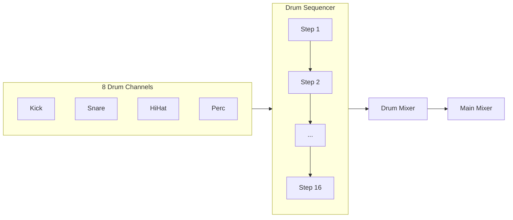
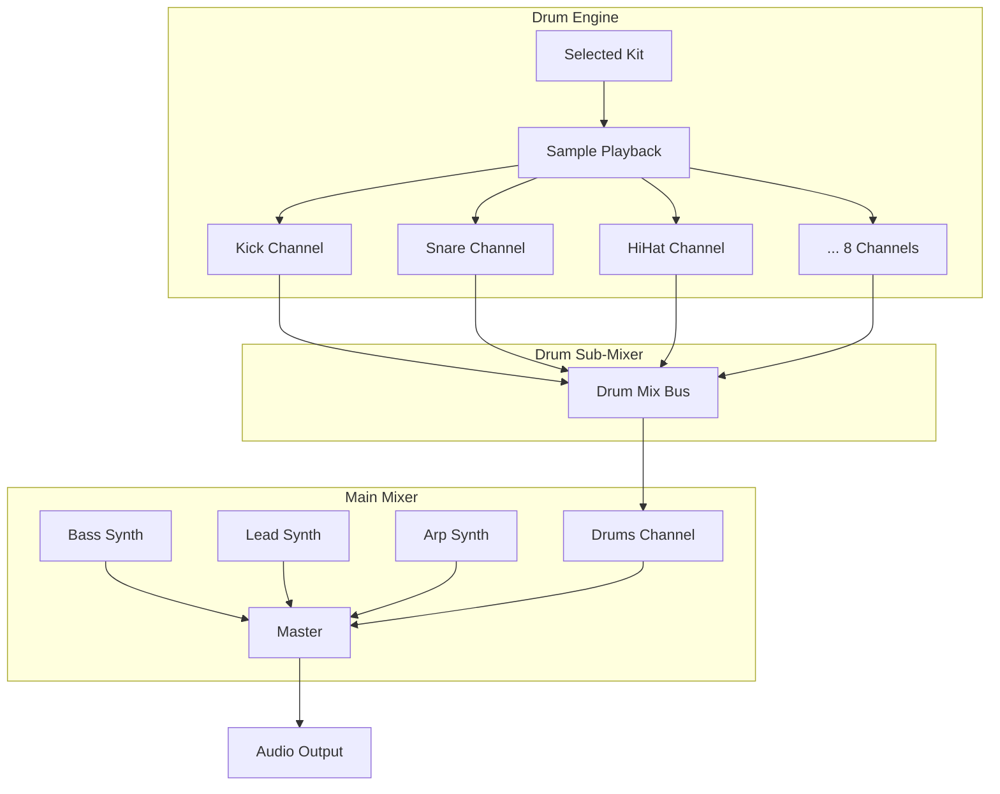

# Drum Machine with Genre Kits + Internal Mixer

## Overview

Add a full-featured drum machine alongside the existing 3-channel synth, with multiple genre-specific kits and its own internal mixer for balancing drum sounds.

---

## Drum Machine Features

### 1. Genre-Specific Drum Kits

Pre-loaded kits optimized for different electronic music styles:

| Kit | Sounds | Best For |
|-----|--------|----------|
| **TR-808** | Deep kick, snappy snare, crisp hats, cowbell, claps | Hip-hop, Trap, Electro |
| **TR-909** | Punchy kick, sharp snare, open/closed hats, ride, crash | House, Techno, Trance |
| **Minimal** | Tight kick, rim shot, shaker, clicks | Minimal Techno, Deep House |
| **Industrial** | Distorted kick, metallic hits, noise bursts | Industrial, EBM, Dark Techno |
| **Breakbeat** | Sampled breaks, punchy drums | Breaks, DnB, Big Beat |

### 2. Drum Channels (8 per kit)

Each kit includes 8 drum sounds:
- **Kick** - Main bass drum
- **Snare** - Snare/clap
- **Closed Hat** - Tight hi-hat
- **Open Hat** - Open hi-hat  
- **Tom/Perc 1** - Tom or percussion
- **Tom/Perc 2** - Additional percussion
- **Cymbal** - Ride/crash
- **FX** - Kit-specific effect sound

### 3. 16-Step Pattern Sequencer



### 4. Internal Drum Mixer

Each drum channel has:
- **Volume** slider (0-100%)
- **Pan** knob (L/R)
- **Mute** button
- Quick visual level meters

### 5. Main Mixer Integration

The drum machine appears as a single channel in the main mixer:
- **DRUMS** channel alongside Bass, Lead, Arp
- Master volume for entire drum mix
- Mute/Solo for drums as a whole

---

## User Interface Layout

### Drum Section (collapsible panel)

```
┌─────────────────────────────────────────────────┐
│ 🥁 DRUMS    [Kit: TR-909 ▼]    [Swing: 50%]    │
├─────────────────────────────────────────────────┤
│ KCK  ○●○○ ○○○○ ○●○○ ○○○○  [Vol] [Pan] [M]     │
│ SNR  ○○○○ ●○○○ ○○○○ ●○○○  [Vol] [Pan] [M]     │
│ CHH  ●●●● ●●●● ●●●● ●●●●  [Vol] [Pan] [M]     │
│ OHH  ○○○○ ○○●○ ○○○○ ○○●○  [Vol] [Pan] [M]     │
│ PRC  ○○○● ○○○○ ○○○● ○○○○  [Vol] [Pan] [M]     │
│ ...                                             │
├─────────────────────────────────────────────────┤
│ [Clear] [Random] [Copy Pattern] [Paste]        │
└─────────────────────────────────────────────────┘
```

### Kit Selector Dropdown
- Visual preview of kit sounds
- One-click kit switching
- Preserves pattern when switching kits

---

## Audio Flow



---

## Pattern Features

- **16 steps** per pattern (synced with synth patterns)
- **Velocity/accent** per hit (tap = normal, hold = accent)
- **Swing** control (0-100%) for groove
- **Pattern presets** per genre (classic beats)
- **Random pattern** generator (genre-aware)

---

## Session Integration

Sessions will save:
- Selected drum kit
- Drum pattern (all 8 channels)
- Drum mixer settings (volume/pan/mute per channel)
- Drum master volume

---

## What You'll Get

1. **Professional drum sounds** - High-quality samples for each genre
2. **Instant genre switching** - Change the vibe with one click
3. **Full mixing control** - Balance each drum sound perfectly
4. **Pattern variety** - Classic beats + random generation
5. **Seamless integration** - Synced with synth, unified mixer

---

## Implementation Phases

**Phase 1:** Core drum engine + TR-808 kit + basic sequencer
**Phase 2:** Additional kits (909, Minimal, Industrial, Breakbeat)
**Phase 3:** Internal drum mixer + main mixer integration
**Phase 4:** Pattern presets + random generation
**Phase 5:** Session save/load integration

